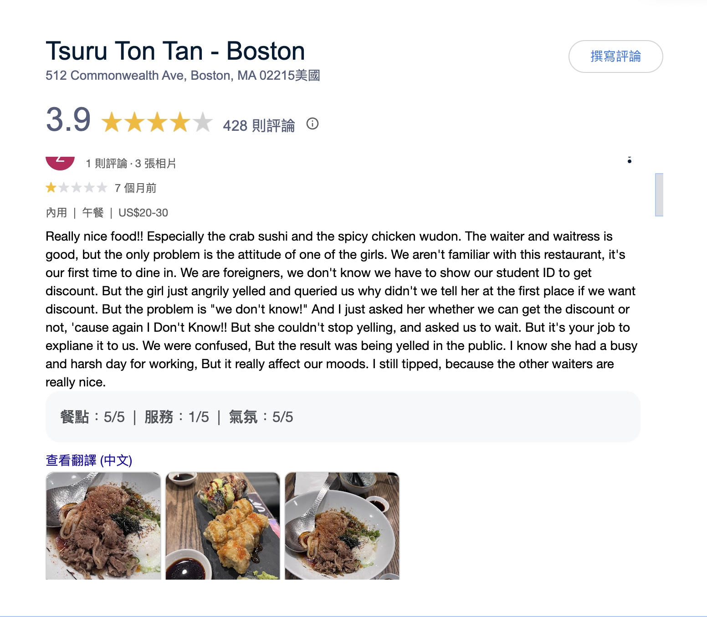

summary: Build SentimentSift to filter emotional bias from online reviews and provide objective insights.
id: docs
categories: AI, NLP, DataEngineering
tags: sentiment-analysis, airflow, streamlit, fastapi , LLM, RAG
authors: Group 1

# SentimentSift: AI-Powered Review Analysis Platform

> **Codelab Proposal**  
> *Filtering Noise, Amplifying Truth.*

---

## Overview

**SentimentSift** is an AI-powered platform designed to filter emotional biases from online reviews and provide objective, fact-based insights for consumers and businesses. SentimentSift also providing a curated list of reliable food bloggers. For each trusted blogger, the platform displays a comprehensive list of all restaurants they've previously visited and reviewed, creating a reliable recommendation network that users can trust.

A restaurant owner saying that those who gave the restaurant one-star negative reviews were all saying it took too long to wait, not that the food was bad. So there is an API that can capture the reviews of this store, and then throw it into AI analysis, there should be different results.

---

## **Introduction**

### **Background**
In the competitive restaurant industry, customer reviews and social media feedback play a crucial role in shaping perceptions and influencing dining decisions. However, the absence of a unified system to normalize ratings across platforms and extract actionable insights from unstructured data creates challenges for restaurant owners, customers, and market researchers. Reviews often reflect biases and lack a consolidated evaluation of key aspects such as food, service, and ambiance.

This project aims to address these challenges by developing a tool that consolidates customer feedback from multiple platforms, performs sentiment analysis on reviews, and generates a normalized rating system based on three critical aspects: **Food**, **Service**, and **Ambiance**. Additionally, the project integrates an interactive chatbot powered by **Retrieval-Augmented Generation (RAG)** and **Large Language Models (LLMs)** to provide precise, context-aware responses to user queries.

### **Objective**
The goal is to deliver actionable insights to stakeholders through:
- **Restaurant Owners**: Brief reports summarizing trends observed in high-performing restaurants.
- **Customers**: Consolidated, unbiased ratings for informed dining decisions.
- **Market Researchers**: Insights into dining trends and customer preferences.
- An advanced chatbot capable of answering specific questions about restaurants (e.g., cuisine type, amenities, operating hours) using RAG and LLM integration.

---

## **Project Overview**

 

### **Scope**

#### **Data Sources**
The project will use data from:
- **Google API**: For reviews and ratings due to its vast dataset.
- **Yelp API**: Provides detailed reviews and metadata about restaurants.
- **Twitter API**: Acts as a social media analytics tool with free API access.

#### **Technologies**
1. **PyABSA**: Aspect-based sentiment analysis for extracting sentiment scores for food, service, and ambiance.
2. **BERTopic**: Extracts recurring themes from customer reviews.
3. **Pinecone**: Stores vector embeddings with metadata (e.g., restaurant name, location).
4. **Snowflake**: Used for data preprocessing and validation with dbt support.
5. **Streamlit**: Provides an interactive UI for querying trends and visualizing insights.
6. **LangChain & OpenAI GPT-4**: Combines RAG with LLMs for chatbot functionality.

#### **Deliverables**
1. Cleaned datasets stored in JSON format in Amazon S3.
2. Normalized sentiment scores visualized on a scale of 10/100.
3. Tiered summary reports highlighting trends grouped by restaurant rankings.
4. An interactive Streamlit interface enabling:
   - Natural language queries.
   - Visualization of trends (e.g., top-tier restaurants by cuisine or amenities).
5. A RAG-powered chatbot integrated with LLMs to answer user queries with contextually relevant responses.

---

### **Stakeholders**
- **Restaurant Owners:** Gain insights into strengths/weaknesses through actionable reports.
- **Market Researchers:** Identify emerging trends in dining preferences using consolidated analytics.
- **Customers:** Access unbiased, normalized ratings to make informed dining decisions.

---

## **Problem Statement**

### **Current Challenges**
1. Managing unstructured review data across multiple platforms with inconsistent rating scales.
2. Limited tools to extract meaningful insights from customer feedback.
3. Inability to identify trends or patterns in high-rated vs low-rated restaurants.

### **Opportunities**
1. Improved decision-making could lead to a 10% increase in customer retention by addressing weaknesses identified through sentiment analysis.
2. Enhanced analytics could reduce response time to negative reviews by providing real-time alerts on recurring issues.

### **Use Cases**
1. Consolidated ratings for Boston-based restaurants based on sentiment scores for food, service, and ambiance.
2. Tiered summary reports highlighting common themes in customer feedback for high-performing restaurants.
3. Interactive querying of restaurant trends via Streamlit UI.
4. Chatbot functionality enabling advanced queries such as:
   - "What are the top-rated Italian restaurants in Boston?"
   - "Which restaurants are open late with outdoor seating?"
   - "What are common complaints about service in low-rated restaurants?"

---

## **Methodology**

### **Data Sources**
The project will collect structured (restaurant details) and unstructured (reviews) data from Google API, Yelp API, and Twitter API.

#### Exception Handling:
- Restaurants with limited reviews or no ratings will be flagged during preprocessing.

### **Technologies and Tools**
1. PyABSA for aspect-based sentiment analysis.
2. BERTopic for theme extraction from labeled text generated by PyABSA.
3. Pinecone as the vector database for storing embeddings with metadata.
4. LangChain & OpenAI GPT-4 for RAG-powered chatbot integration.

---

### **Data Pipeline Design**

#### Workflow Diagram
Data Ingestion:

Collect structured (restaurant details) and unstructured (reviews) data via APIs.

Data Preprocessing:

Normalize ratings across platforms; clean text; add metadata.

Data Storage:

Store raw JSON files in Amazon S3; stage preprocessed data in Snowflake.

Sentiment Analysis & Theme Extraction:

Use PyABSA for aspect-based scoring; feed labeled text into BERTopic.

Vector Embedding Storage:

Store embeddings with metadata in Pinecone.

Chatbot Integration:

Use LangChain & GPT-4 to build a RAG-powered chatbot for advanced queries.

Visualization & Querying:

Develop Streamlit UI for querying trends and visualizing insights.

text

---

## **Project Plan and Timeline**

### Timeline
| Day       | Task                                                                                   | Assigned To                  |
|-----------|-----------------------------------------------------------------------------------------|------------------------------|
| Day 1–2   | API integration; initial data collection; store raw JSON files in S3                  | Data Engineer                |
| Day 3–4   | Data cleaning/preprocessing; Snowflake setup                                           | Data Engineer                |
| Day 5–6   | Sentiment analysis implementation using PyABSA                                         | Machine Learning Engineer    |
| Day 7     | RAG pipeline setup; Pinecone integration; LLM fine-tuning                              | Machine Learning Engineer    |
| Day 8–9   | Theme extraction using BERTopic                                                       | Machine Learning Engineer    |
| Day 10–11 | Streamlit UI development                                                              | Frontend Developer           |
| Day 12–13 | Chatbot enhancement with RAG/LLM integration                                           | ML Engineer & Frontend Dev   |
| Day 14    | Final testing; deployment                                                             | All Team Members             |

---

## **Resources and Team**

### Personnel
- Data Engineer: Responsible for API integration, data collection/preprocessing, Snowflake setup.
- Machine Learning Engineer: Implements sentiment analysis (PyABSA), theme extraction (BERTopic), RAG pipeline setup, chatbot enhancement.
- Frontend Developer: Develops the Streamlit UI interface; integrates chatbot functionality.

---

## **Risks and Mitigation Strategies**

### Risks
1. API rate limits or geographic restrictions may delay data collection.
2. Sparse review data may impact insight accuracy.
3. Integration challenges between multiple technologies/tools.

### Mitigation Strategies
1. Use caching mechanisms or multiple API keys to handle rate limits effectively.
2. Flag insufficient data cases during preprocessing; supplement with synthetic datasets if necessary.
3. Conduct regular testing during integration phases to identify bottlenecks early.

---

## **Expected Outcomes and Benefits**

### Measurable Goals
1. Achieve >90% accuracy in aspect-based sentiment analysis results.
2. Reduce time taken to analyze customer feedback by at least 50%.

### Expected Benefits
1. Actionable insights into strengths/weaknesses grouped by restaurant tiers for owners.
2. Access to unbiased ratings normalized across platforms for customers.
3. Identification of emerging trends in customer preferences for market researchers.

---

## **Conclusion**
SentimentSift integrates advanced tools like PyABSA, BERTopic, Pinecone, LangChain, OpenAI GPT-4, Snowflake, and Streamlit to bridge the gap between unstructured feedback and actionable insights within the restaurant industry—revolutionizing decision-making while enhancing customer satisfaction through its innovative RAG-powered chatbot functionality!

## **Authors**
- Team: Anuj Rajendraprasad Nene, Sicheng Bao, Yung-Rou Ko
- Course: 7245 Big-Data Final Project

---
